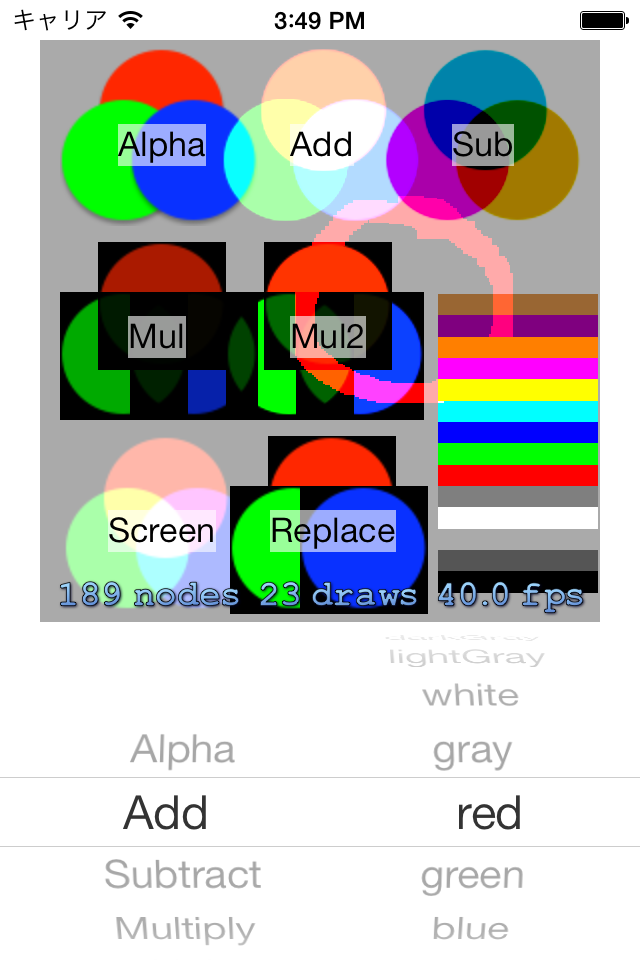

SKSpriteBlendMode
====================

iOS 7 よりサポートされた Sprite Kit に含まれる SKSpriteNode の学習用サンプルです。

特に blendMode の理解を進めることを目的に作りました。結果は見ての通りです。SKSpriteNode は Interface Builder で配置した UIImageView の位置と画像データを元にして生成するようにしています。
